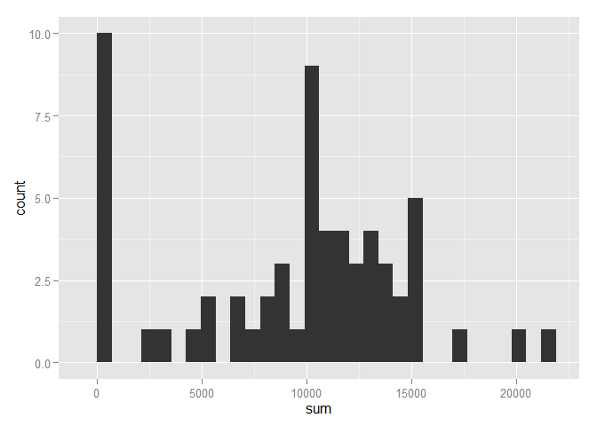
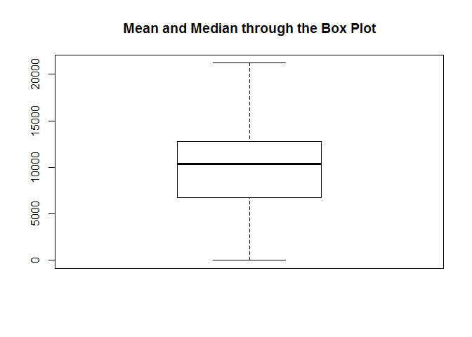
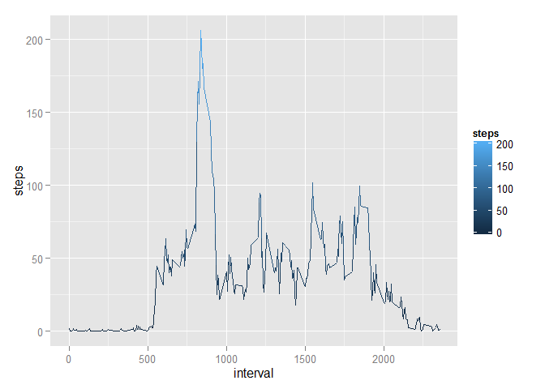
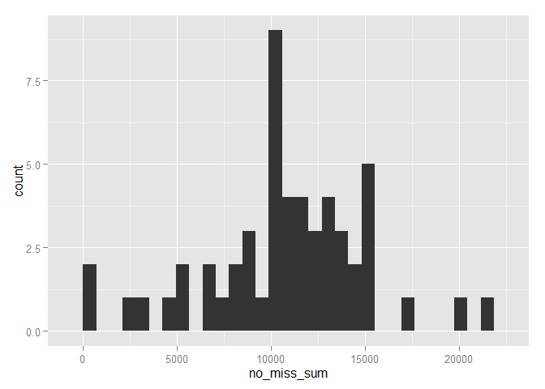
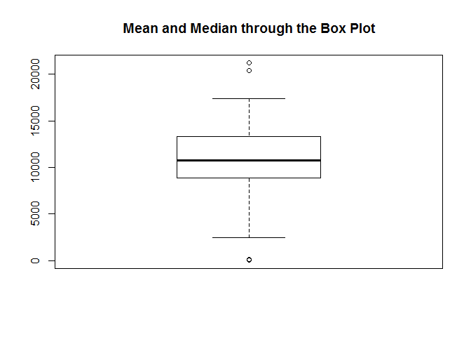
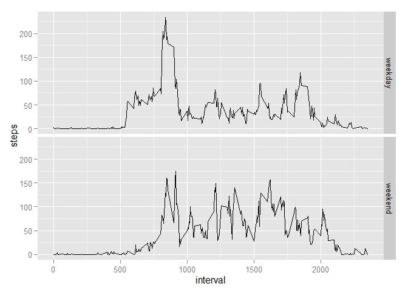

# Reproducible Research: Peer Assessment 1
setwd('C:/Users/GAAS/Desktop/workspace/datascience/4-reproducible/RepData_PeerAssessment1/')


## Loading and preprocessing the data


```r
library(data.table) ## For the sake of efficiency and speed of aggregation : - )

## Decompressing the zip file
dt = data.table(read.csv2(unzip("activity.zip") 
                          , sep = ","
                          , header = TRUE))
                          
dt$date = as.Date(dt$date) ## Converting the column $date to Date type
```

## What is mean total number of steps taken per day?

```r
library(ggplot2) ## Nice plotting resources : - )

# Calculate the total number of steps taken per day

## Aggregating number of steps by days while ignoring missing cases
sum = tapply(dt$steps, dt$date, sum, na.rm = TRUE)

# If you do not understand the difference between a histogram and a barplot, research the 
# difference between them. Make a histogram of the total number of steps taken each day

## Histogram plotted as asked by the exercise
ggplot(aes(x = sum), data = as.data.table(sum)
       , binwidth = 1000) + 
        geom_histogram()
```

 

```r
# Calculate and report the mean and median of the total number of steps taken per day

summary(sum)
```

```
##    Min. 1st Qu.  Median    Mean 3rd Qu.    Max. 
##       0    6778   10400    9354   12810   21190
```

```r
boxplot(x = sum, main = "Mean and Median through the Box Plot")
```

 

## What is the average daily activity pattern?


```r
# Make a time series plot (i.e. type = "l") of the 5-minute interval (x-axis) 
# and the average number of steps taken, averaged across all days (y-axis)

# Calculating the average number of steps taken across all days by intervals


mean = data.table(aggregate(steps ~ interval
               , dt
               , FUN = "mean"
               , na.ignore = TRUE)) 

# Plotting the time series of 5-minute interval and average number of steps taken

ggplot(aes(x = interval, y = steps, colour=steps), data = mean) + geom_line()
```

 

## Which 5-minute interval, on average across all the days in the dataset, contains the maximum number of steps?


```r
# Extracting the 10th Intervals containing the maximum number of steps on average across all the days
head(mean[order(steps, decreasing = TRUE),], 10)
```

```
##     interval    steps
##  1:      835 206.1698
##  2:      840 195.9245
##  3:      850 183.3962
##  4:      845 179.5660
##  5:      830 177.3019
##  6:      820 171.1509
##  7:      855 167.0189
##  8:      815 157.5283
##  9:      825 155.3962
## 10:      900 143.4528
```


## Imputing missing values


```r
# Calculate and report the total number of missing values in the dataset (i.e. the total number of rows with NAs)

table(is.na(dt))
```

```
## 
## FALSE  TRUE 
## 50400  2304
```

```r
# the total number of NA's is 2304


# Devise a strategy for filling in all of the missing values in the dataset. The strategy does not need to be sophisticated. For example, you could use the mean/median for that day, or the mean for that 5-minute interval, etc.

# The missing values were filled by zeros when we transformed the data set to MEAN and SUM. CHeck that there are no missing values in the results below:

table(is.na(mean))
```

```
## 
## FALSE 
##   576
```

```r
table(is.na(sum))
```

```
## 
## FALSE 
##    61
```

```r
# Create a new dataset that is equal to the original dataset but with the missing data filled in.

dt_nomissing = na.omit(dt) 

# Make a histogram of the total number of steps taken each day and Calculate and report the mean and median total number of steps taken per day.

no_miss_sum = tapply(dt_nomissing$steps, dt_nomissing$date, sum)

ggplot(aes(x = no_miss_sum), data = as.data.table(no_miss_sum)
       , binwidth = 1000) + 
        geom_histogram()
```

 

```r
summary(no_miss_sum)
```

```
##    Min. 1st Qu.  Median    Mean 3rd Qu.    Max. 
##      41    8841   10760   10770   13290   21190
```

```r
boxplot(x = no_miss_sum, main = "Mean and Median through the Box Plot")
```

 

```r
# Do these values differ from the estimates from the first part of the assignment? What is the impact of imputing missing data on the estimates of the total daily number of steps?

# Response: Yes, the impact is that some occurencies were not calculated, what decreased the total, median and mean.
```


## Are there differences in activity patterns between weekdays and weekends?


```r
# Create a new factor variable in the dataset with two levels - "weekday" and "weekend" indicating whether a given date is a weekday or weekend day.

dt_nomissing$weekday = as.factor(ifelse(weekdays(dt_nomissing$date) == "Saturday" | weekdays(dt_nomissing$date) ==  "Sunday", "weekend", "weekday"))


# Make a panel plot containing a time series plot (i.e. type = "l") of the 5-minute interval (x-axis) and the average number of steps taken, averaged across all weekday days or weekend days (y-axis). See the README file in the GitHub repository to see an example of what this plot should look like using simulated data.

weekdays = aggregate(steps ~ interval + weekday
                     , dt_nomissing
                     , FUN = "mean")

ggplot(aes(x = interval, y = steps), data = weekdays) + 
        geom_line() + 
        facet_grid(weekday ~ .)
```

 
